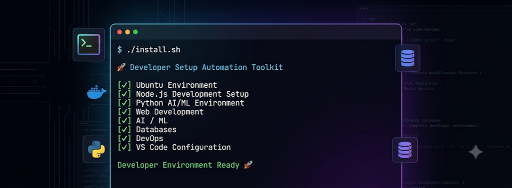
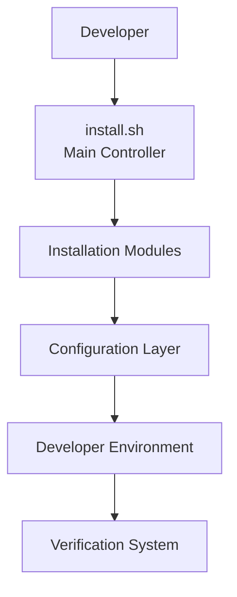

# 🚀 Developer Setup Automation Toolkit

<p align="center">



</p>

<p align="center">

<strong>
One command to setup your complete developer environment.
</strong>

<br>

Automate Web Development, AI/ML, Databases, and DevOps environment setup with a modular Bash automation toolkit.

</p>


<p align="center">


</p>


<p align="center">


</p>


---

# 📖 Overview


**Developer Setup Automation Toolkit** is a modular Bash-based automation framework designed to configure a complete professional developer environment automatically.


Instead of manually installing and configuring every tool, this toolkit provides a repeatable and customizable setup workflow.


It helps developers quickly configure:


- 🌐 Full Stack Web Development Environment
- 🤖 Artificial Intelligence & Machine Learning Environment
- 🗄 Database Development Environment
- 🐳 DevOps Tools and Services
- 🛠 Developer Productivity Utilities


The main goal:


> Setup once. Configure automatically. Start building faster.


---


# 💡 Why This Project?


Setting up a development machine from scratch requires installing and configuring many tools manually.


Developers usually need:


- Programming languages
- Package managers
- Databases
- AI/ML libraries
- Development utilities
- Terminal customization
- Docker environment
- Editor configuration


This toolkit reduces repetitive setup work by providing:


✅ Automated installation  
✅ Modular architecture  
✅ Custom setup options  
✅ Environment verification  
✅ Troubleshooting utilities  
✅ Safe updates  
✅ Easy customization  


---


# ✨ Key Features


## 🖥 Complete System Setup


Automatically configures:


- Ubuntu packages
- Essential CLI utilities
- Zsh terminal
- Powerlevel10k theme
- Git environment
- Developer workspace


---


# 🌐 Web Development Environment


Provides a complete modern full-stack development environment.


| Technology | Included |
|---|---|
| Node.js | ✅ |
| npm | ✅ |
| pnpm | ✅ |
| Bun | ✅ |
| Nodemon | ✅ |
| PostgreSQL | ✅ |
| MongoDB | ✅ |
| Redis | ✅ |


Designed for:


- MERN Stack Development
- Backend API Development
- Full Stack Applications
- Database Driven Projects


---


# 🤖 AI / Machine Learning Environment


Creates a complete Python AI development ecosystem.


| Library | Purpose |
|---|---|
| NumPy | Numerical Computing |
| Pandas | Data Analysis |
| Matplotlib | Data Visualization |
| Scikit-learn | Machine Learning |
| PyTorch | Deep Learning |
| OpenCV | Computer Vision |
| Transformers | NLP & LLM Applications |
| LangChain | LLM Application Development |
| LangGraph | AI Agent Workflows |
| LlamaIndex | Data Framework |
| FAISS | Vector Similarity Search |
| ChromaDB | Vector Database |


Useful for:


- Machine Learning Projects
- Deep Learning
- Computer Vision
- Generative AI
- RAG Applications
- AI Agents


---


# 🐳 DevOps Environment


Includes essential DevOps tooling:


- Docker
- Docker Compose
- GitHub CLI
- Lazygit
- Developer CLI utilities


Useful for:


- Container development
- Deployment workflows
- DevOps learning
- Cloud-ready development


---


# 🧰 Supported Technologies


| Category | Technologies |
|---|---|
| Operating System | Ubuntu 22.04 / 24.04, WSL2 |
| Shell | Bash, Zsh |
| Terminal | Powerlevel10k |
| Runtime | Node.js, Python |
| Package Managers | npm, pnpm, Bun |
| Backend | Node.js, Express.js |
| Database | PostgreSQL, MongoDB, Redis |
| AI/ML | PyTorch, Transformers, LangChain |
| Vector Database | FAISS, ChromaDB |
| DevOps | Docker, Docker Compose |
| Editor | VS Code |
| CLI Tools | GitHub CLI, Lazygit, HTTPie |


---

# 🏗 Architecture Overview


The Developer Setup Automation Toolkit follows a **modular architecture** where every setup component works as an independent module.


Each module handles a specific responsibility, making the toolkit easy to maintain, customize, and extend.


---


# 🔄 System Architecture





---


# 🧩 Architecture Principles


| Principle | Description |
|---|---|
| 🧩 Modular | Every component has independent installation scripts |
| 🛡 Safe | Detects existing installations before making changes |
| ♻️ Reusable | Scripts can run independently |
| 🚀 Extensible | Easy to add new technologies |
| 🔍 Verifiable | Includes verification and diagnostic tools |
| 👨‍💻 Developer Friendly | Easy to customize and maintain |


---


# 🔄 Installation Workflow


The toolkit follows a structured automation workflow:


```text
Developer

    ↓

Run install.sh

    ↓

Check System Requirements

    ↓

Install Base Dependencies

    ↓

Configure Development Environment

    ↓

Setup Programming Languages

    ↓

Install Databases

    ↓

Configure AI/ML Environment

    ↓

Setup Docker & DevOps Tools

    ↓

Configure VS Code

    ↓

Verify Environment

    ↓

Ready for Development 🚀
```


---


# 📂 Project Structure


```text
Developer-Setup/

│
├── install.sh                 # Main installation controller
├── verify.sh                  # Environment verification
├── doctor.sh                  # Troubleshooting utility
├── update.sh                  # Update system components
├── uninstall.sh               # Cleanup utility
│
├── scripts/
│
│   ├── 01-base.sh             # Ubuntu packages and CLI tools
│   ├── 02-terminal.sh         # Zsh + Powerlevel10k setup
│   ├── 03-git.sh              # Git configuration
│   ├── 04-node.sh             # Node.js ecosystem
│   ├── 05-postgresql.sh       # PostgreSQL setup
│   ├── 06-mongodb.sh          # MongoDB setup
│   ├── 07-redis.sh            # Redis setup
│   ├── 08-python.sh           # Python environment
│   ├── 09-ai.sh               # AI/ML environment
│   ├── 10-docker.sh           # Docker setup
│   ├── 11-vscode.sh           # VS Code setup
│   ├── 12-devtools.sh         # Developer utilities
│   └── 13-workspace.sh        # Workspace creation
│
├── config/                    # Configuration files
│
├── docs/                      # Documentation files
│
├── logs/                      # Runtime installation logs
│
├── CHANGELOG.md
├── LICENSE
└── README.md
```


---


# ⚙️ Module Overview


## 🖥 Base System Setup


Script:

```bash
scripts/01-base.sh
```


Responsible for:


- Ubuntu package updates
- Essential CLI tools
- System utilities
- Basic dependencies


---


## 🎨 Terminal Customization


Script:

```bash
scripts/02-terminal.sh
```


Includes:


- Zsh installation
- Oh My Zsh
- Powerlevel10k theme
- Terminal configuration


---


## 🔧 Git Configuration


Script:

```bash
scripts/03-git.sh
```


Configures:


- Git installation
- User configuration
- Developer Git environment


---


## 🌐 Node.js Development Environment


Script:

```bash
scripts/04-node.sh
```


Installs:


- Node.js
- npm
- pnpm
- Bun
- Nodemon


---


## 🗄 Database Environment


Scripts:


```text
scripts/05-postgresql.sh

scripts/06-mongodb.sh

scripts/07-redis.sh
```


Provides:


- PostgreSQL database
- MongoDB database
- Redis caching system


---


## 🐍 Python Environment


Script:


```bash
scripts/08-python.sh
```


Creates:


- Python development environment
- Virtual environment setup
- Python tooling


---


## 🤖 AI / ML Environment


Script:


```bash
scripts/09-ai.sh
```


Provides:


- NumPy
- Pandas
- Scikit-learn
- PyTorch
- OpenCV
- Transformers
- LangChain
- LangGraph
- LlamaIndex
- FAISS
- ChromaDB


---


## 🐳 Docker Environment


Script:


```bash
scripts/10-docker.sh
```


Installs and configures:


- Docker Engine
- Docker Compose
- Container development environment


---


## 💻 VS Code Setup


Script:


```bash
scripts/11-vscode.sh
```


Configures:


- VS Code CLI
- Developer extensions
- WSL integration


---


## 🛠 Developer Tools


Script:


```bash
scripts/12-devtools.sh
```


Includes:


- GitHub CLI
- Lazygit
- HTTPie
- YAML utilities


---


## 📁 Workspace Setup


Script:


```bash
scripts/13-workspace.sh
```


Creates:


- Developer workspace
- Project templates
- Learning directories
- Development structure


---


# 🔍 Verification Architecture


The toolkit includes two diagnostic systems:


## verify.sh


Checks:


- Installed tools
- Runtime versions
- Database connections
- Python packages
- Docker availability
- VS Code setup


## doctor.sh


Checks:


- Environment problems
- PATH configuration
- Missing dependencies
- Service issues
- Configuration problems


---


Detailed architecture documentation:


➡️ [Architecture Documentation](docs/ARCHITECTURE.md)


---

# ⚡ Quick Start


Setup your complete developer environment with a simple automated workflow.


The toolkit provides an interactive installation process that allows you to choose between a complete setup or specific development environments.


---


# 📋 Requirements


Before starting, make sure your system meets the following requirements:


| Requirement | Details |
|---|---|
| Operating System | Ubuntu 22.04 / 24.04 |
| Windows Support | WSL2 |
| Internet Connection | Required |
| User Permission | sudo access |
| Shell | Bash / Zsh |


---


# 📥 Installation Guide


## 1. Clone Repository


Clone the repository from GitHub:


```bash
git clone https://github.com/riturajlabs/Developer-Setup.git

cd Developer-Setup
```


---


## 2. Give Execute Permission


Make all scripts executable:


```bash
chmod +x *.sh
chmod +x scripts/*.sh
```


---


## 3. Run Installer


Start the automated setup:


```bash
./install.sh
```


The installer provides an interactive menu:


```text
=================================

 Developer Setup Installer

=================================


1) Full Developer Setup

2) Custom Setup

3) Web Development Setup

4) AI / ML Setup

5) Database Setup

6) DevOps Setup

7) Verify Installation

8) Doctor

9) Update Installer

0) Exit


=================================
```


---


# 🎯 Installation Modes


Choose the environment according to your development requirements.


| Mode | Purpose |
|---|---|
| 🚀 Full Developer Setup | Complete development environment |
| 🌐 Web Development Setup | Node.js ecosystem and full-stack tools |
| 🤖 AI / ML Setup | Python AI and Machine Learning environment |
| 🗄 Database Setup | PostgreSQL, MongoDB and Redis services |
| 🐳 DevOps Setup | Docker and container tools |
| ⚙️ Custom Setup | Select required components |


---


# 🔍 Verification System


After installation, verify your environment:


```bash
./verify.sh
```


The verification system checks:


```text
✓ System Tools

✓ Git Configuration

✓ Node.js Environment

✓ npm

✓ pnpm

✓ Bun

✓ Nodemon

✓ PostgreSQL

✓ MongoDB

✓ Redis

✓ Python Environment

✓ AI/ML Libraries

✓ Docker

✓ Docker Compose

✓ VS Code
```


Example output:


```text
=================================

 Developer Environment Check

=================================


[SUCCESS] Git

[SUCCESS] Node.js

[SUCCESS] PostgreSQL

[SUCCESS] MongoDB

[SUCCESS] Redis

[SUCCESS] Python AI Environment

[SUCCESS] Docker

[SUCCESS] VS Code


Passed : XX

Failed : XX


Environment Ready 🚀


=================================
```


---


# 🩺 Doctor Tool


The Doctor utility helps developers diagnose and troubleshoot environment issues.


Run:


```bash
./doctor.sh
```


The Doctor tool checks:


- Environment configuration
- PATH configuration
- Missing dependencies
- Broken installations
- Database services
- Python environment
- Docker status
- VS Code integration


Example:


```text
=================================

 Developer Environment Doctor

=================================


[SUCCESS] WSL environment detected

[SUCCESS] Node environment

[SUCCESS] Database services

[SUCCESS] Python AI environment

[SUCCESS] Docker

[SUCCESS] VS Code


Issues Found : 0


Your developer environment is healthy 🚀
```


---


# 🔄 Update System


Keep your development environment updated using the update utility.


Run:


```bash
./update.sh
```


Update workflow:


```text
System Packages

        ↓

Node.js Ecosystem

        ↓

Python Packages

        ↓

Docker Maintenance

        ↓

Toolkit Updates
```


The update system handles:


- Ubuntu package updates
- Node package updates
- Python environment updates
- Docker cleanup
- Toolkit maintenance


---


# 🗑 Uninstall System


Remove installed components safely using the uninstall utility.


Run:


```bash
./uninstall.sh
```


Available cleanup options:


```text
=================================

 Developer Setup Uninstaller

=================================


1) Remove Developer Tools

2) Remove Node Environment

3) Remove Python AI Environment

4) Remove Databases

5) Remove Docker

6) Clean Workspace

7) Full Cleanup

0) Exit


=================================
```


Safety features:


✅ Confirmation before deletion

✅ Selective component removal

✅ Protects user projects

✅ Detailed cleanup logs

✅ Prevents accidental cleanup


---


# 📚 Installation Documentation


For detailed installation instructions:


➡️ [Installation Documentation](docs/INSTALLATION.md)


---

# 📚 Documentation


Complete documentation is available inside the `docs/` directory.


The documentation covers installation, architecture, customization, troubleshooting, and contribution guidelines.


| Document | Description |
|---|---|
| [INSTALLATION.md](docs/INSTALLATION.md) | Complete installation guide |
| [ARCHITECTURE.md](docs/ARCHITECTURE.md) | System architecture details |
| [CUSTOMIZATION.md](docs/CUSTOMIZATION.md) | Add or modify setup modules |
| [TROUBLESHOOTING.md](docs/TROUBLESHOOTING.md) | Common issues and solutions |
| [CONTRIBUTING.md](docs/CONTRIBUTING.md) | Contribution guidelines |


---


# 🛣 Roadmap


## ✅ Completed


- [x] Modular Bash installer
- [x] Ubuntu support
- [x] WSL2 support
- [x] Terminal customization
- [x] Zsh + Powerlevel10k setup
- [x] Git automation
- [x] Node.js development environment
- [x] PostgreSQL setup
- [x] MongoDB setup
- [x] Redis setup
- [x] Python development environment
- [x] AI/ML libraries setup
- [x] Docker integration
- [x] VS Code automation
- [x] Developer utilities setup
- [x] Verification system
- [x] Doctor troubleshooting tool
- [x] Safe uninstall system
- [x] Developer workspace creation


---


## 🚀 Future Improvements


- [ ] Java Development Setup
- [ ] Rust Development Setup
- [ ] Go Development Setup
- [ ] Kubernetes Automation
- [ ] Terraform Setup
- [ ] Cloud CLI Integration
- [ ] CI/CD Pipeline Templates
- [ ] GUI Installer
- [ ] Configuration-based installation
- [ ] Profile-based setup system
- [ ] Multi Linux distribution support
- [ ] Backup and restore system
- [ ] Interactive setup wizard


---


# 🔐 Security & Safety


The toolkit follows safe automation practices to prevent unwanted system changes.


Security features:


✅ Existing installation detection

✅ Safe package installation

✅ No hidden scripts

✅ User confirmation before destructive operations

✅ Detailed installation logs

✅ Error handling and validation

✅ Modular execution flow


The installation workflow follows:


```text
Detect

 ↓

Validate

 ↓

Install

 ↓

Configure

 ↓

Verify
```


---


# 🤝 Contributing


Contributions are welcome!


If you want to improve this project, add new technologies, or improve documentation, follow the contribution workflow below.


---


## 1. Fork Repository


Create your own fork of the repository.


```bash
git clone <repository-url>
```


---


## 2. Create Feature Branch


Create a new branch for your changes:


```bash
git checkout -b feature-name
```


---


## 3. Make Changes


Improve:


- Installation scripts
- Documentation
- Configuration files
- Verification tools
- New technology modules


---


## 4. Commit Changes


```bash
git add .

git commit -m "Add new feature"
```


---


## 5. Push Changes


```bash
git push origin feature-name
```


Create a Pull Request with:


- Clear description
- Testing details
- Screenshots (if required)
- Reason for changes


Contribution guidelines:


➡️ [CONTRIBUTING.md](docs/CONTRIBUTING.md)


---


# 📄 License


This project is licensed under the **MIT License**.


You are free to:


- Use
- Modify
- Distribute
- Learn from this project


See the complete license:


➡️ [LICENSE](LICENSE)


---


# ⭐ Support


If this project helped you:


⭐ Star the repository

📢 Share it with other developers

🤝 Contribute improvements


Your support helps the project grow and motivates further development.


---


# 👨‍💻 Author


<p align="center">


## Ritu Raj


AI & Machine Learning Student | Full Stack Developer | Developer Tools Enthusiast


<a href="https://github.com/riturajlabs">


</a>


<a href="https://linkedin.com/in/riturajlabs">


</a>


</p>


---


# 🚀 Final Note


Developer Setup Automation Toolkit was created to reduce repetitive setup work and help developers start building faster.


Instead of spending hours configuring development environments:


```text
Install once.

Configure automatically.

Start building.
```


---


<p align="center">

Built with ❤️ for developers.

</p>


<p align="center">


</p>
