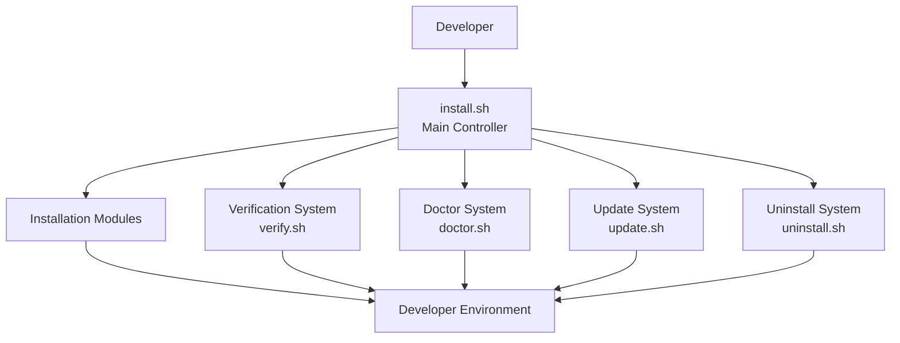
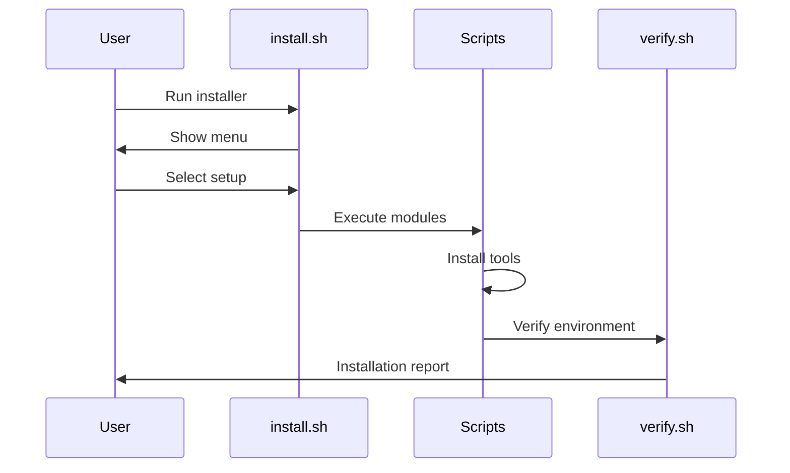
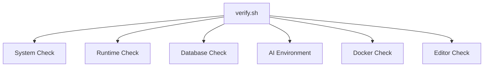

# 🏗 Architecture Documentation

## Developer Setup Automation Toolkit


This document explains the internal architecture and design principles of the **Developer Setup Automation Toolkit**.

The toolkit follows a **modular script-driven architecture** where every setup responsibility is separated into independent modules.

This design makes the system:

- Easy to maintain
- Easy to debug
- Easy to extend
- Safe to execute repeatedly
- Developer friendly


---

# 🧩 High Level Architecture




---

# 📁 Core Components


## 1. Main Controller


### install.sh


The main entry point of the toolkit.


Responsibilities:


- Display installation menu
- Detect system information
- Load configuration
- Execute selected modules
- Handle installation flow


Flow:


```text
User

 |

 v

install.sh

 |

 v

Select Setup Mode

 |

 v

Execute Required Scripts

 |

 v

Configure Environment

 |

 v

Verify Installation

```

---

# 2. Installation Modules


All installation logic is separated into scripts inside:


```
scripts/
```


Structure:


```
scripts/

01-base.sh

02-terminal.sh

03-git.sh

04-node.sh

05-postgresql.sh

06-mongodb.sh

07-redis.sh

08-python.sh

09-ai.sh

10-docker.sh

11-vscode.sh

12-devtools.sh

13-workspace.sh

utils.sh

```


---

# Module Responsibilities


## 01-base.sh

System preparation:


- Update packages
- Install essential utilities
- Configure base environment


---

## 02-terminal.sh


Terminal customization:


- Install Zsh
- Configure Oh My Zsh
- Install Powerlevel10k theme


---

## 03-git.sh


Git configuration:


- Install Git
- Configure username/email
- Setup useful aliases


---

## 04-node.sh


Node development environment:


Installs:


```
Node.js

npm

pnpm

Bun

Nodemon

```


---

## 05-07 Database Modules


Database automation:


```
05-postgresql.sh

06-mongodb.sh

07-redis.sh
```


Responsibilities:


- Installation
- Service configuration
- Health checks


---

## 08-python.sh


Python environment setup:


Creates:


```
Python Virtual Environment

        |

        +-- pip

        +-- Jupyter

        +-- Development Tools

```


---

## 09-ai.sh


AI/ML environment:


Installs:


```
NumPy

Pandas

Scikit-learn

PyTorch

OpenCV

Transformers

LangChain

LangGraph

FAISS

ChromaDB

```


---

## 10-docker.sh


Container environment:


Installs:


```
Docker Engine

Docker Compose

```


---

## 11-vscode.sh


Editor automation:


- Install VS Code
- Configure extensions
- Developer settings


---

## 12-devtools.sh


Developer utilities:


```
GitHub CLI

Lazygit

jq

ripgrep

tmux

htop

btop

```


---

## 13-workspace.sh


Creates developer workspace:


```
~/Developer

```


---

# 🔄 Execution Flow





---

# ⚙️ Configuration Architecture


Configuration files are stored:


```
config/
```


Structure:


```
config/

├── packages.conf

├── node-tools.conf

├── ai-packages.conf

└── settings.conf

```


---

# Configuration Purpose


## packages.conf


Stores system packages.


Example:


```bash
curl

wget

git

tree

htop

```


---

## node-tools.conf


Stores Node ecosystem packages.


Example:


```text
pnpm

bun

nodemon

```


---

## ai-packages.conf


Stores AI/ML dependencies.


Example:


```text
torch

transformers

langchain

faiss

chromadb

```


---

## settings.conf


Stores environment settings.


Example:


```bash
WORKSPACE_DIR=~/Developer

PYTHON_ENV=venv

```


---

# 🧰 Utility Layer


Shared functions are stored:


```
scripts/utils.sh
```


Provides reusable functions:


```bash
log_message()

check_command()

install_package()

command_exists()

success_message()

error_message()

```


Benefits:


- Avoid code duplication
- Consistent output
- Easier maintenance


---

# 🔍 Verification Architecture


The verification system checks:





---

# 🩺 Doctor Architecture


Doctor follows a diagnostic pipeline:


```text
Environment

     |

     v

PATH Validation

     |

     v

Command Detection

     |

     v

Service Health

     |

     v

Dependency Check

     |

     v

Solution Report

```


---

# 🏛 Design Principles


## Modular

Each feature has an independent script.


## Idempotent

Running scripts multiple times should not break the system.


## Safe

Existing installations are detected before changes.


## Extensible

New technologies can be added easily.


Example:


```
scripts/

14-java.sh

15-rust.sh

16-kubernetes.sh

```


---

# 🚀 Future Architecture Improvements


Planned improvements:


- YAML based configuration
- Plugin system
- Interactive GUI installer
- Cloud environment profiles
- Multi Linux distribution support
- Automated backup and restore


---

# Summary


Developer Setup Automation Toolkit uses a modular automation architecture where:


```
Controller

    ↓

Installation Modules

    ↓

Configuration Layer

    ↓

Environment Setup

    ↓

Verification & Maintenance

```


This architecture allows developers to create a complete development environment quickly, safely, and consistently.
